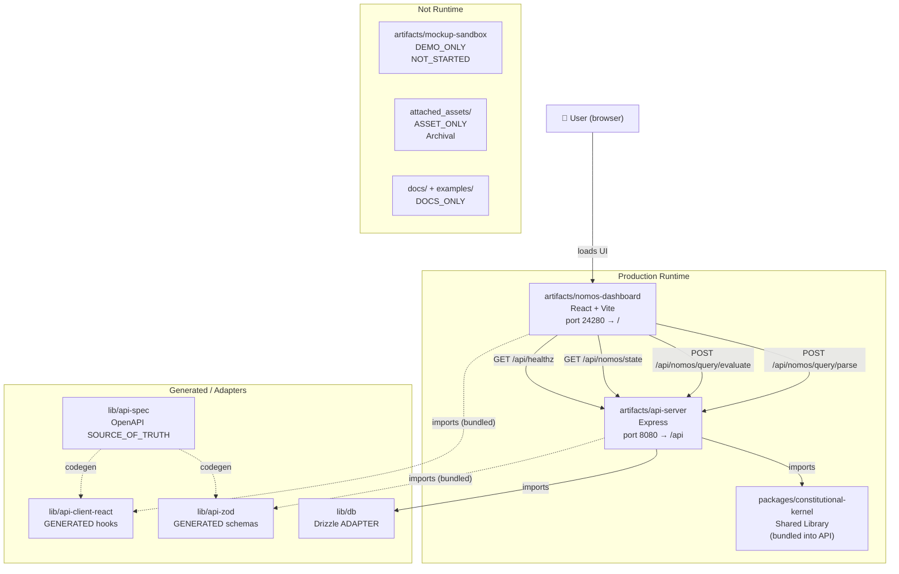
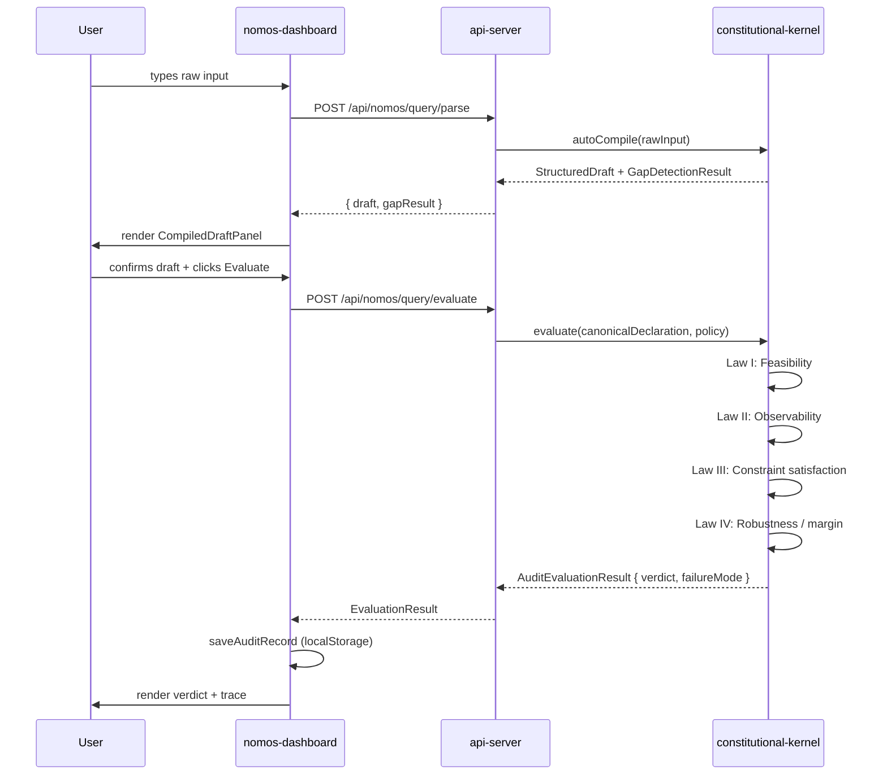
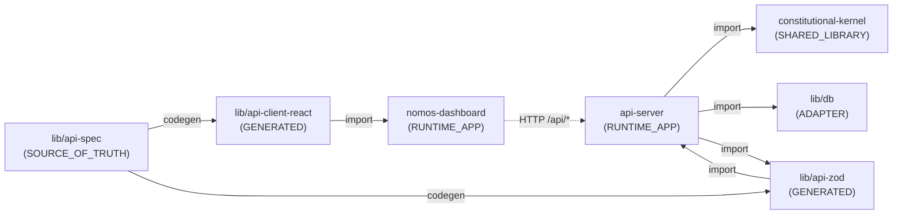
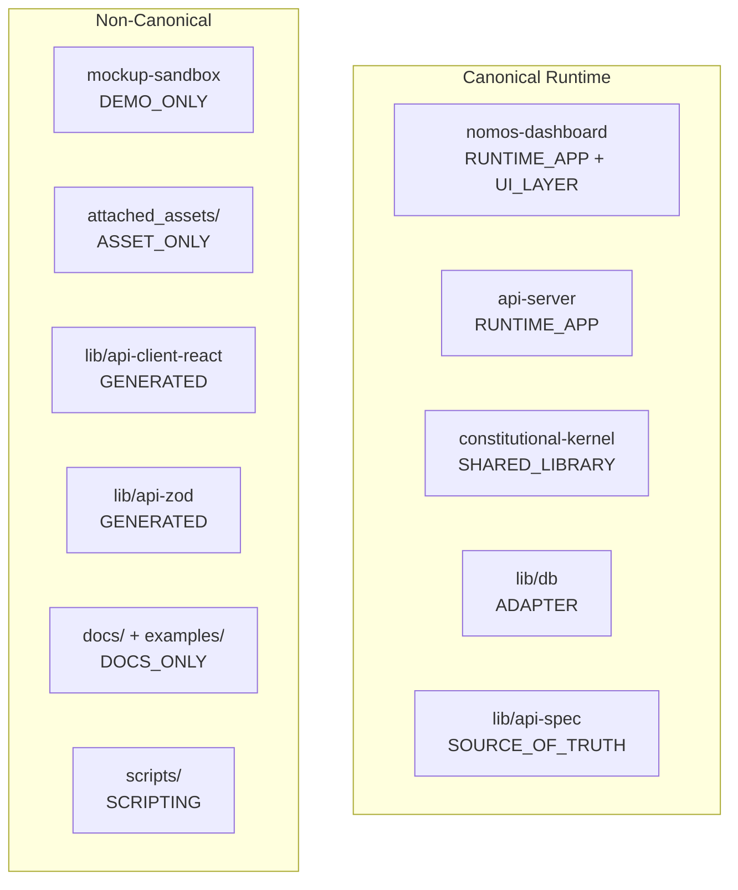

# NOMOS Runtime — Mermaid Diagrams

> Mermaid source for all runtime diagrams.
> Paste into any Mermaid renderer or GitHub markdown preview.

---

## Primary Runtime Architecture

---

## Query Evaluate Flow

---

## Dependency Direction

---

## Package Roles

